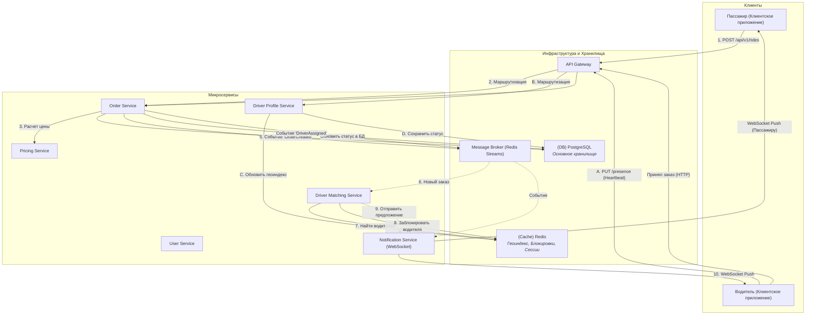

## **Архитектурное описание: Сервис заказа такси "Taxi Grid"**

Этот документ представляет собой окончательное архитектурное решение для бэкенд-приложения "Taxi Grid". Система спроектирована для эффективной работы в рамках сеточной модели города N×M, с учетом нефункциональных требований по производительности (до 1k водителей онлайн) и надежности.

### 1. Концептуальная схема решения

Архитектура построена на основе микросервисного подхода с **асинхронным ядром на базе событий (event-driven)**. Это обеспечивает слабую связанность сервисов, их независимое масштабирование и высокую отказоустойчивость.

---

### Вариант 1: Схема в формате Mermaid

Эта схема четко разделяет синхронные и асинхронные потоки данных.



### Вариант 2: Визуальная схема (в стиле Excalidraw) с описанием

Эта схема более наглядно показывает взаимодействие компонентов и потоки данных с пошаговыми комментариями.

**Легенда:**
*   `[Название]` - Микросервис
*   `(Название)` - Хранилище данных / Инфраструктурный компонент
*   `-->` - Синхронный запрос (HTTP)
*   `-.->` - Асинхронное сообщение (Событие)
*   `--ws-->` - Сообщение по WebSocket

```
+----------------+                                        +----------------+
|    Пассажир    |                                        |     Водитель   |
+----------------+                                        +----------------+
        |                                                          ^      |
        | 1. Запрос на поездку (HTTP)                              |      | A. Heartbeat (HTTP)
        |                                                  10. Уведомление|      |
        v                                                     (WebSocket) |      v
+--------------------------------------------------------------------------------+
|                                (API Gateway)                                 |
+--------------------------------------------------------------------------------+
        | 2.                                                       | B.
        |                                                          |
        v                                                          v
+----------------+  3. Расчет цены  +------------------+   +----------------------+
| [OrderService] |--------------->| [PricingService] |   | [DriverProfileService] |
+----------------+                +------------------+   +----------------------+
   |          |                                                |             |
   | 4.       | 5.                                             | C.          | D.
   v          v                                                v             v
+---------------------------+       +--------------------------------------------+
| (Message Broker / Redis Streams)  |                (PostgreSQL)                  |
|     [Событие: OrderCreated]       | [Таблицы: users, rides, drivers, ...]      |
+---------------------------+       +--------------------------------------------+
             | 6.                                ^              ^
             | (Новый заказ)                     | 4.           | D.
             |                                   | Сохранить    | Сохранить
             v                                   | заказ        | статус
+---------------------------+                    |              |
| [DriverMatchingService]   |                    |              |
+---------------------------+                    |              |
             |                                   |              |
             | 7. Поиск & 8. Блокировка          |              |
             v                                   |              |
+----------------------------------+             |              |
|          (Redis Cache)           | <-----------+--------------+
| [Геоиндекс, Блокировки, Сессии]  | C. Обновить геоиндекс
+----------------------------------+

             | 9. Отправить предложение
             v
+---------------------------+
|  [NotificationService]    | --ws--> (см. шаг 10 к Водителю)
+---------------------------+

```

#### **Описание потока "Заказ поездки":**

1.  **Пассажир** отправляет запрос на создание поездки через **API Gateway**.
2.  **API Gateway** аутентифицирует запрос и направляет его в **Order Service**.
3.  **Order Service** для расчета цены синхронно обращается к **Pricing Service**.
4.  **Order Service** сохраняет новый заказ со статусом `pending` в базу данных **PostgreSQL**.
5.  **Order Service** публикует событие `OrderCreated` в **Message Broker (Redis Streams)**. На этом синхронный запрос от пассажира завершается, и он получает ответ.
6.  **Driver Matching Service**, как подписчик, получает событие `OrderCreated` из брокера.
7.  Сервис выполняет поиск ближайших свободных водителей, используя **геоиндекс в Redis**.
8.  Найдя подходящего кандидата, он ставит на него временную блокировку в **Redis**.
9.  **Driver Matching Service** обращается к **Notification Service** с командой отправить предложение водителю.
10. **Notification Service** отправляет push-уведомление через **WebSocket** на устройство **водителя**.

#### **Описание потока "Обновление статуса водителя":**

A.  **Водитель** отправляет heartbeat-запрос со своим статусом и координатами в **API Gateway**.
B.  Запрос маршрутизируется в **Driver Profile Service**.
C.  Сервис обновляет местоположение водителя в **геоиндексе Redis** для его участия в поиске.
D.  Сервис также сохраняет актуальный статус (`online`, `offline`) в **PostgreSQL**.


#### Ключевые потоки данных:

1.  **Заказ поездки**: Пассажир через **API Gateway** запрашивает поездку. **Order Service** создает заказ в PostgreSQL и публикует событие `OrderCreated` в **Message Broker (Redis Streams)**. Процесс поиска водителя запускается асинхронно, не блокируя ответ клиенту.
2.  **Обновление статуса водителя**: Водительское приложение через **API Gateway** отправляет heartbeat-запросы со своим статусом и координатами. **Driver Profile Service** обновляет эти данные в **Redis** для мгновенного доступа и в **PostgreSQL** для персистентности.
3.  **Назначение водителя**: **Driver Matching Service**, подписанный на события `OrderCreated`, получает новый заказ. Он выполняет высокопроизводительный поиск ближайшего водителя в **Redis**, блокирует его и отправляет предложение через **Notification Service (WebSocket)**. После подтверждения публикуется событие `DriverAssigned`, на которое реагируют другие сервисы для обновления состояний.

### 2. Стратегия хранения данных

Выбрана гибридная модель хранения, использующая сильные стороны реляционной и in-memory баз данных для разных задач.

#### 2.1. PostgreSQL: Основное хранилище (System of Record)

**Обоснование**: PostgreSQL выбран как основное хранилище за счет гарантий **ACID**, строгой консистентности данных и возможностей для аналитических запросов.

**Финальная схема данных**:

```sql
-- Перечисляемые типы для обеспечения целостности данных
CREATE TYPE driver_status AS ENUM ('offline', 'online', 'busy');
CREATE TYPE ride_status AS ENUM ('pending', 'driver_assigned', 'driver_arrived', 'passenger_onboard', 'in_progress', 'completed', 'cancelled');

-- Пользователи (общая таблица для аутентификации)
CREATE TABLE users (
    id BIGSERIAL PRIMARY KEY,
    email VARCHAR(255) UNIQUE NOT NULL,
    -- ... другие поля аутентификации
    created_at TIMESTAMP WITH TIME ZONE DEFAULT NOW()
);

-- Профиль водителя
CREATE TABLE drivers (
    user_id BIGINT PRIMARY KEY REFERENCES users(id) ON DELETE CASCADE,
    status driver_status NOT NULL DEFAULT 'offline',
    -- ... другие поля профиля
    version INTEGER NOT NULL DEFAULT 1 -- Для оптимистических блокировок
);

-- Профиль пассажира
CREATE TABLE passengers (
    user_id BIGINT PRIMARY KEY REFERENCES users(id) ON DELETE CASCADE,
    -- ... другие поля профиля
    version INTEGER NOT NULL DEFAULT 1
);

-- Поездки
CREATE TABLE rides (
    id BIGSERIAL PRIMARY KEY,
    passenger_user_id BIGINT NOT NULL REFERENCES users(id),
    driver_user_id BIGINT REFERENCES users(id),
    status ride_status NOT NULL,
    start_x INTEGER NOT NULL,
    start_y INTEGER NOT NULL,
    end_x INTEGER NOT NULL,
    end_y INTEGER NOT NULL,
    price DECIMAL(10,2) NOT NULL,
    created_at TIMESTAMP WITH TIME ZONE DEFAULT NOW(),
    -- ... другие временные метки
    version INTEGER NOT NULL DEFAULT 1
);

-- Бизнес-правило: У водителя может быть только одна активная поездка
CREATE UNIQUE INDEX idx_unique_active_driver_ride
ON rides (driver_user_id)
WHERE status IN ('driver_assigned', 'driver_arrived', 'passenger_onboard', 'in_progress');
```

#### 2.2. Redis: Хранилище для данных реального времени

**Обоснование**: Redis используется для всех операций, требующих минимальной задержки: управление геопозициями, очередями и сессиями.

**Структуры данных**:

*   **Геоиндекс водителей по ячейкам сетки (Hash)**: Для мгновенного поиска ближайших водителей используется стратегия индексации по координатам. Это позволяет избежать полного сканирования всех водителей.
    *   **Структура**: Ключ имеет формат `cell:X:Y`. Внутри Hash хранятся ID водителей, находящихся в этой ячейке.
        `HSET "cell:15:20" "driver_id_1" "online"`
    *   **Алгоритм поиска**: При поступлении заказа из точки `(x,y)` сервис ищет водителей, проверяя ячейки по расширяющейся спирали `(x,y)`, `(x±1, y)`, `(x, y±1)` и т.д. Это гарантирует нахождение ближайшего водителя за минимальное количество операций.

*   **Брокер сообщений (Redis Streams)**: Для асинхронного взаимодействия между сервисами.
    *   **Структура**: Используются потоки (streams) для публикации событий, таких как `OrderCreated`. Это обеспечивает гарантированную доставку и возможность обработки событий группами потребителей.

*   **Блокировки водителей (String с TTL)**: Для предотвращения "состояния гонки" при назначении заказа.
    *   **Команда**: `SET driver_lock:{driver_id} {order_id} EX 30 NX`

### 3. Ключевые сервисы и их ответственность

1.  **API Gateway**: Единая точка входа. Маршрутизация, JWT-аутентификация, Rate Limiting, терминирование WebSocket.
2.  **User Service**: Регистрация, авторизация, управление профилями пользователей.
3.  **Driver Profile Service**: Управление состоянием водителя: статус (`online`/`offline`), обновление координат в Redis и PostgreSQL.
4.  **Order Service**: Управление жизненным циклом заказов (создание, обновление статуса, история). Владелец таблицы `rides`.
5.  **Pricing Service**: Расчет стоимости и ETA поездки на основе тарифов и расстояния по формуле: `ETA = |x1−x2| + |y1−y2| * t_cell`, `Цена = base_fare + (|x1−x2| + |y1−y2|) * price_per_cell`.
6.  **Driver Matching Service**: Асинхронный обработчик, который ищет и назначает водителей на заказы. Реализует логику таймаутов и очередей. Реализует детерминированное правило выбора при равенстве расстояний (например, по наименьшему ID водителя).
7.  **Notification Service**: Управляет WebSocket-соединениями и отправляет таргетированные real-time уведомления пользователям.

### 4. Ключевые API-эндпоинты

#### 4.1. Аутентификация
*   `POST /api/v1/auth/login` — Получение JWT токена.

#### 4.2. Управление состоянием водителя
*   `PUT /api/v1/drivers/me/presence`
    *   **Назначение**: Heartbeat-запрос от водителя для обновления статуса и местоположения.
    *   **Тело запроса**: `{"status": "online", "location": { "x": 15, "y": 20 }}`

#### 4.3. Управление поездками
*   `POST /api/v1/rides`
    *   **Назначение**: Создание нового заказа пассажиром.
    *   **Тело запроса**: `{"start_x": 10, "start_y": 15, "end_x": 25, "end_y": 30}`
    *   **Ответ**: `{"ride_id": "...", "estimated_price": 15.50, "status": "pending"}`

*   `POST /api/v1/rides/{id}/accept`
    *   **Назначение**: Принятие заказа водителем.

*   `PUT /api/v1/rides/{id}/status`
    *   **Назначение**: Изменение статуса поездки (например, `cancelled` пассажиром, `completed` водителем).
    *   **Тело запроса**: `{"status": "cancelled"}`

#### 4.4. История поездок
*   `GET /api/v1/users/me/rides`
    *   **Назначение**: Получение истории поездок для аутентифицированного пользователя.

#### 4.5. WebSocket
*   `ws://api.taxi.com/ws?token={jwt_token}`
    *   **Назначение**: Канал для получения real-time обновлений о статусе поездки и местоположении водителя.